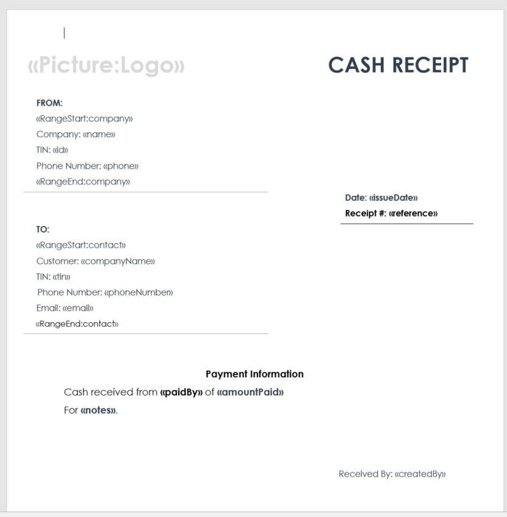
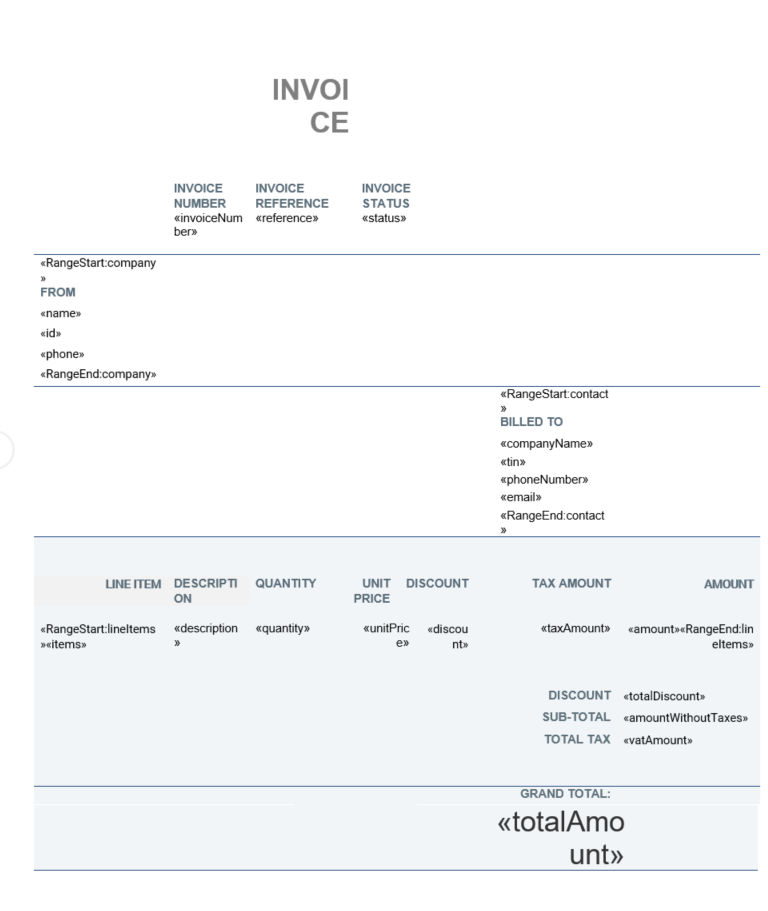
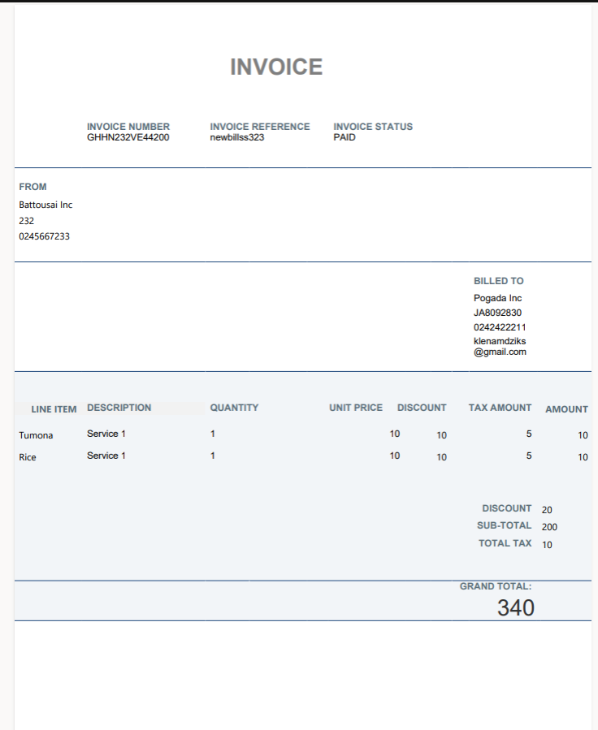

# Examples

This is what a typical template should look like.
It should have placeholders for the various pieces of `data`.
The names of the placeholders should be the exact same names of the `Keys` in the `Json`.

<p>
    
</p>

## Example 1

This is an example for the `Expand File Mutation`

::: details  JSON Data
```json
{

"title": "Klenam",

"subTitle": "Testing Invoice2",

 

"company": {

"logo": "",

"name": "Battousai Inc",

"id": "232",

"phone": "0245667233"

},

"invoiceNumber": "GHHN232VE44200",

"reference": "newbillss323",

"status": "PAID",

"contact": {

"companyName": "Pogada Inc",

"tin": "JA8092830",

"phoneNumber": "0242422211",

"email": "klenamdziks@gmail.com"

},

"lineItems": [

{

"items": "Tumona",

"description": "Service 1",

"quantity": 1,

"unitPrice": 10,

"discount": 10,

"taxAmount": 5,

"amount": 10

},

{

"items": "Rice",

"description": "Service 1",

"quantity": 1,

"unitPrice": 10,

"discount": 10,

"taxAmount": 5,

"amount": 10

}

],

"totalDiscount": 20,

"amountWithoutTaxes": 200,

"vatAmount": 10,

"totalAmount": 340

}

```
:::

This is the piece of `json` data I would like to create a template with.


::: details The Template



:::

This is the template 

::: details The Result

:::

This is the result 